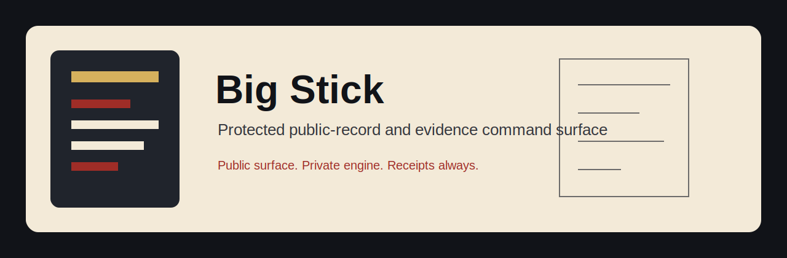
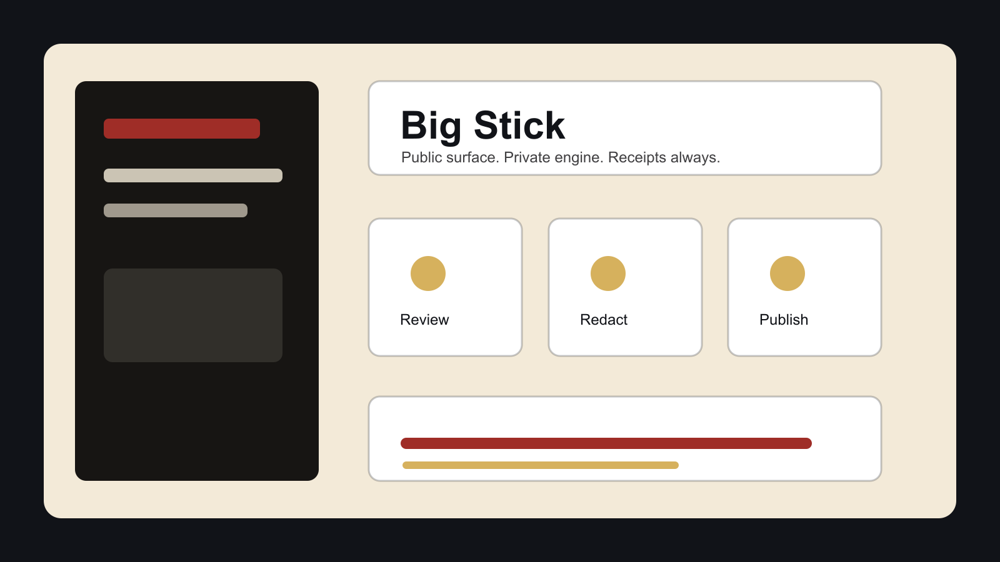
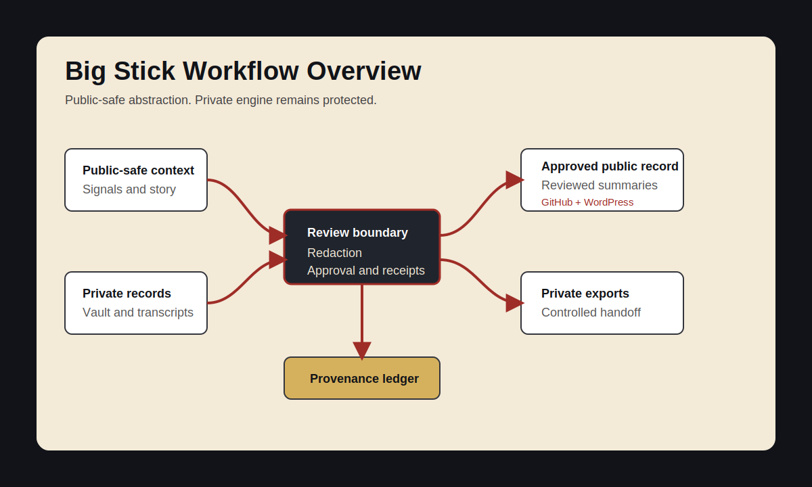
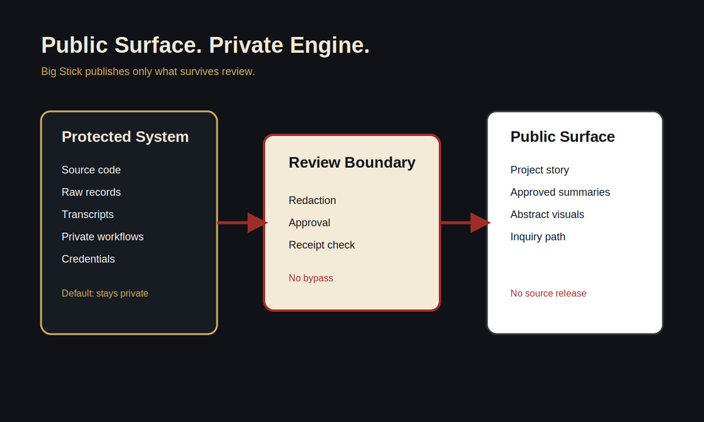

# Big Stick

Big Stick is a protected local command center for organizing public-record work,
private evidence review, transcript intake, archive retrieval, AI-assisted
drafts, and export readiness without collapsing private material into public
view.

This repository is a protected public project surface. It is not the full
source code, operational system, private workflow, or data room.

## How It Works

Big Stick keeps public-facing context, private evidence, transcript intake,
archive retrieval, AI drafts, and exports in separate review lanes. Public
materials move outward only after redaction and approval. Private records stay
inside the protected system.

## Who It Is For

Big Stick is designed around people doing serious documentation, advocacy, and
case-management work where public narrative, private evidence, and personal
safety boundaries all have to be handled carefully.

The current local build is Faith Cheltenham's protected project surface. Any
future pilot, partnership, research discussion, or private demo is by Faith's
choice only.

## Why It Matters

Many tools flatten records into tasks or turn private evidence into content too
quickly. Big Stick treats boundaries as part of the product:

- private material stays private by default;
- public-facing records require review and redaction;
- transcript and archive work can feed evidence review without exposing raw
  files;
- AI output remains draft material until reviewed;
- receipts, provenance, and export paths matter.

## What Is Public Here

- A high-level project description.
- A public/private boundary statement.
- Workflow diagrams and abstract public-safe visuals.
- A public-safe image asset audit and visual gallery.
- Public-safe engagement notes.
- A non-binding roadmap.
- WordPress-ready draft copy for a possible FaithCheltenham.com project page.
- Image briefs and prompt directions for original abstract visuals.

## What Remains Private

- Source code and build internals.
- Private workflows, prompts, agent instructions, and adapters.
- Credentials, environment values, tokens, signing materials, and deployment
  details.
- Raw evidence, transcripts, archive data, legal/admin/medical/family records,
  private receipts, screenshots, and operational strategy.
- Any public publishing, repo creation, or product access decision.

## Current Status

This is the canonical first public surface for Big Stick:
`thefayth/big-stick`.

The private engine remains closed. The WordPress page is drafted but not
published. Public materials are ready for Faith review.

## Visual Assets

- [GitHub banner](assets/banners/big-stick-github-banner.svg)
- [GitHub banner PNG](assets/banners/github-banner.png)
- [Hero image](assets/hero/hero-image.png)
- [Project icon](assets/gallery/big-stick-logo-mark.svg)
- [Illustrated project icon](assets/icons/project-icon.png)
- [Hero panel](assets/gallery/big-stick-hero-panel.svg)
- [WordPress featured image](assets/gallery/big-stick-wordpress-featured.svg)
- [Social card](assets/social/big-stick-social-card.svg)
- [Social card PNG](assets/social/social-card.png)

## Respectful Inquiry

For private discussion, partnership review, press/background context, or future
pilot consideration, contact Faith through her official channels.

No public license, download, checkout, price, or access grant is provided here.

## Learn More

- [Project brief](docs/PROJECT_BRIEF.md)
- [Public/private boundary](docs/PUBLIC_PRIVATE_BOUNDARY.md)
- [Workflow diagrams](docs/WORKFLOW_DIAGRAMS.md)
- [Brand style notes](docs/BRAND_STYLE_NOTES.md)
- [Image asset audit](docs/IMAGE_ASSET_AUDIT.md)
- [Canva asset plan](docs/CANVA_ASSET_PLAN.md)
- [Privacy review](docs/PRIVACY_REVIEW.md)
- [WordPress page draft](wordpress/page.md)
